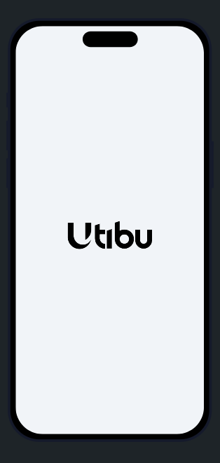
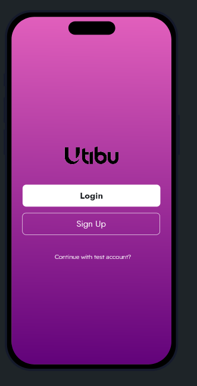
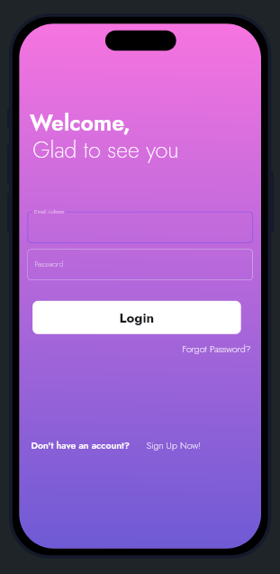
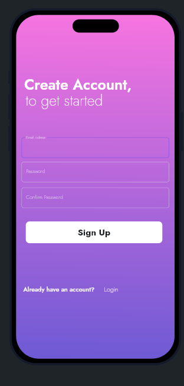
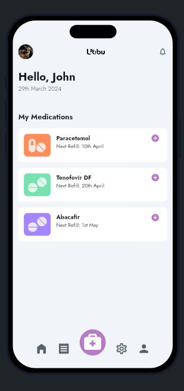
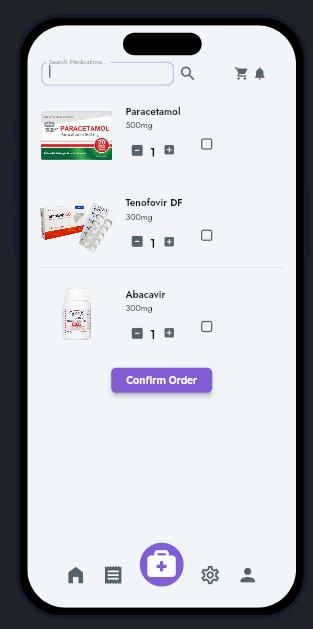

# Utibu Health Mobile App

The Utibu Health Mobile App is a cross-platform mobile application designed to cater to patients with chronic conditions. 

It allows registered customers to make medication orders remotely and check their statements through the app. The app is integrated with the legacy database system of Utibu Health to ensure that online orders are saved and reflected in the database.

## Features

- **Medication Ordering**: Customers can browse and select medications, check availability, add to cart, and place orders.
- **Statement Checking**: Customers can view their current statement, including previous orders and payments.
- **Integration with Legacy System**: Implemented RESTful APIs for communication with the legacy database system.

## Technology Stack

- **Frontend**: [Dart with Flutter](./frontend/README.md)
- **Backend**: [Python Flask](./backend/README.md)
- **Database**: Microsoft SQL Server
- **Integration**: RESTful APIs

## Security
- Implemented HTTPS for secure data transmission.
- Used OAuth for user authentication.

## Offline Support
- Used local storage to store data temporarily and sync with the server when online.

## User Experience

- Designed the app's UI/UX using Figma for a modern and intuitive interface. [View Figma Design](https://www.figma.com/file/T3O1OcGZROQuEuv4vzN9j4/utibu_app-UI?type=design&node-id=0%3A1&mode=design&t=0BaARpRbt3rAcWiR-1)

## Installation

1. Clone the repository: `git clone https://github.com/vincent-mugendi/utibu_app.git`
2. Install dependencies: `cd project-name` then `npm install`
3. Set up environment variables (see `.env.example` for reference).
4. Initialize the database: `flask db upgrade`
5. Apply migrations: `flask db upgrade`
6. Start the server: `flask run`

## Preview

- Test the app in [FlutterFlow](link-to-flutterflow-app) for a preview of the UI.

## Screenshots

    
    
    
    
    
    

## Contribution

We welcome contributions to the Utibu Health Mobile App. If you have any suggestions, bug reports, or feature requests, please open an issue or submit a pull request.

## License

This project is licensed under the MIT License - see the [LICENSE](https://opensource.org/licenses/MIT) file for details.
